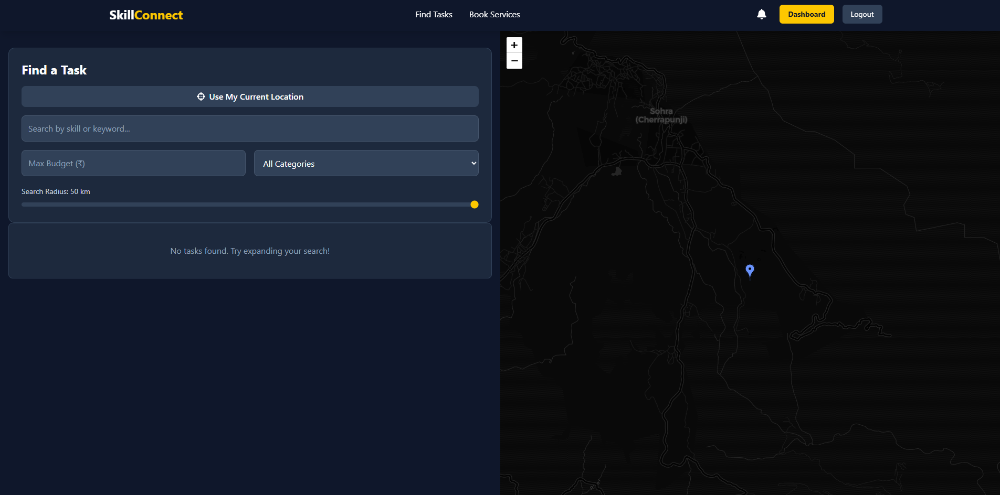

# SkillConnect ✨

SkillConnect is a hyperlocal platform designed to connect individuals within a community. Users can post tasks they need help with, allowing skilled providers in their vicinity to bid on them. Alternatively, users can browse and instantly book pre-defined services offered by local providers.

The platform facilitates communication through real-time chat, manages secure payments via Stripe, and keeps users informed with push notifications.

---

## 🚀 Features

* **Task Posting & Bidding:** Users can post tasks with descriptions, budgets, and locations. Local providers can view and bid on these tasks.
* **Instant Service Booking:** Providers can list fixed-price services (like lawn mowing, tutoring) that users can book directly.
* **Geospatial Search:** Find tasks and services within a specific radius using latitude and longitude.
* **User Profiles & Ratings:** Users have profiles displaying skills, bio, portfolio images, and an average rating based on completed tasks/services.
* **Secure Payments:** Integration with Stripe for handling payments for both bid-based tasks and instant bookings. Supports Card payments and Cash agreements. Payouts for providers via Stripe Express accounts.
* **Real-time Chat:** Integrated chat functionality (using Socket.IO) between task seekers and assigned providers for communication related to ongoing tasks.
* **Notifications:** Real-time (Socket.IO) and push notifications (Firebase Cloud Messaging) for events like new bids, new messages, task assignments, and task completion statuses.
* **Dashboard:** Centralized view for users to manage posted tasks, booked services, assigned jobs, and offered services, along with a financial overview.

---

## 🛠️ Tech Stack

* **Frontend:** React, TypeScript, Vite, Tailwind CSS, React Leaflet (for maps), Socket.IO Client, Stripe.js, Firebase Messaging
* **Backend:** Node.js, Express.js, MongoDB, Mongoose, Socket.IO, JSON Web Tokens (JWT), Stripe SDK, Firebase Admin SDK (for FCM), Bcrypt.js
* **Database:** MongoDB (with Mongoose ODM)
* **Deployment (Example):** Docker, Nginx (for client static files)

---

## ⚙️ Setup Instructions

### Prerequisites

* Node.js (v18 or later recommended)
* npm or yarn
* MongoDB (local instance or a cloud service like MongoDB Atlas)
* Git
* Stripe Account
* Firebase Project

### 1. Clone & Install Dependencies

1.  **Clone the repository:**
    ```bash
    git clone <your-repository-url>
    cd skill-connect
    ```

2.  **Install Server Dependencies:**
    ```bash
    cd server
    npm install
    ```

3.  **Install Client Dependencies:**
    ```bash
    cd ../client
    npm install
    ```

### 2. Firebase Setup (Push Notifications)

1.  **Create Firebase Project:** Go to the [Firebase Console](https://console.firebase.google.com/) and create a new project (or use an existing one).
2.  **Enable Cloud Messaging:** In your Firebase project settings, navigate to the "Cloud Messaging" tab. You may need to enable the API.
3.  **Get Web Push Certificate (VAPID Key):** In the "Cloud Messaging" tab, under "Web configuration", find or generate a "Web Push certificate" key pair. Copy the **Public Key (VAPID key)**.
4.  **Update Client Firebase Config:**
    * Open `client/src/firebase-config.ts`.
    * Replace the placeholder `firebaseConfig` object with your actual Firebase project configuration values (apiKey, authDomain, etc.).
    * Replace the placeholder `VAPID_KEY` value with the Public Key you copied in the previous step.
    * Open `client/public/firebase-messaging-sw.js`.
    * Replace the placeholder `firebaseConfig` object here as well with the same values.
5.  **Generate Service Account Key (Admin SDK):**
    * In your Firebase project settings, go to the "Service accounts" tab.
    * Click "Generate new private key" and confirm. A JSON file will be downloaded.
6.  **Place Service Account Key:**
    * Create a `config` directory inside your `server` directory (if it doesn't exist).
    * Move the downloaded JSON key file into `server/config/` and **rename it** to `firebase-service-account.json`.
    * **Important:** Add `server/config/firebase-service-account.json` to your `server/.gitignore` file to prevent committing sensitive credentials.

### 3. Stripe Setup (Payments & Payouts)

1.  **Create Stripe Account:** Sign up for a [Stripe account](https://dashboard.stripe.com/register) if you don't have one.
2.  **Get API Keys:** In your Stripe Dashboard, go to "Developers" -> "API keys". Find your **Publishable key** (starts with `pk_...`) and **Secret key** (starts with `sk_...`). You'll likely use the "Test mode" keys initially.
3.  **Set up Webhook:**
    * Go to "Developers" -> "Webhooks".
    * Click "Add endpoint".
    * For the **Endpoint URL**, enter your backend's webhook handler URL.
        * For local development using `npm run dev`, you might need a tool like `ngrok` to expose your local server (e.g., `https://<your-ngrok-id>.ngrok.io/api/payment/stripe-webhook`).
        * For Docker development, use `http://host.docker.internal:5000/api/payment/stripe-webhook` if accessing from your host, or configure appropriately if deployed.
    * Select the event `payment_intent.succeeded`.
    * Click "Add endpoint".
    * After creation, find the **Signing secret** (starts with `whsec_...`) for this endpoint.
4.  **Enable Stripe Connect:**
    * Go to "Connect" -> "Settings" in your Stripe Dashboard.
    * Ensure "Express" accounts are enabled. You might need to fill out some platform details. This allows your providers (users offering services/bids) to onboard and receive payouts.

### 4. Environment Variables Setup

Create the following `.env` files and populate them with the values obtained above and your other configurations:

* **`server/.env`:** (For local development without Docker)
    ```env
    NODE_ENV=development
    PORT=5000
    MONGO_URI=<your_mongodb_connection_string>
    JWT_SECRET=<your_strong_jwt_secret>
    JWT_EXPIRES_IN=30d
    STRIPE_SECRET_KEY=<your_stripe_secret_api_key (sk_...)>
    STRIPE_WEBHOOK_SECRET=<your_stripe_webhook_signing_secret (whsec_...)>
    CLIENT_URL=http://localhost:3000 # Or your deployed client URL
    GOOGLE_APPLICATION_CREDENTIALS=./config/firebase-service-account.json

    # Optional Email Vars
    # EMAIL_HOST=...
    # EMAIL_PORT=...
    # EMAIL_USERNAME=...
    # EMAIL_PASSWORD=...
    # EMAIL_FROM=...
    ```

* **`client/.env`:** (For local development without Docker)
    ```env
    VITE_API_URL=http://localhost:5000/api # Or your deployed API URL
    VITE_STRIPE_KEY=<your_stripe_public_api_key (pk_...)>
    ```

* **`.env` (in project root):** (For Docker Compose)
    ```env
    # Server Vars
    NODE_ENV=production # Or development if preferred for Docker dev
    PORT=5000
    MONGO_URI=mongodb://mongo:27017/skillconnect # Example using mongo service
    # MONGO_URI=<your_external_mongo_uri> # Use this if MongoDB is outside Docker
    JWT_SECRET=<your_strong_jwt_secret>
    JWT_EXPIRES_IN=30d
    STRIPE_SECRET_KEY=<your_stripe_secret_api_key (sk_...)>
    STRIPE_WEBHOOK_SECRET=<your_stripe_webhook_signing_secret (whsec_...)>
    CLIENT_URL=http://localhost:3000 # URL client is accessed at on host
    GOOGLE_APPLICATION_CREDENTIALS=./server/config/firebase-service-account.json # Relative path from root

    # Client Build Vars (Note: NO VITE_ prefix here for docker-compose build args)
    API_URL=http://server:5000/api
    STRIPE_KEY=<your_stripe_public_api_key (pk_...)>

    # Optional Email Vars
    # EMAIL_HOST=...
    # ... etc
    ```

**Important Security Note:** **NEVER** commit `.env` files or your `firebase-service-account.json` file to Git. Ensure they are listed in your `.gitignore` files.

---

## ▶️ Running the Application

### Locally (without Docker)

1.  **Start MongoDB:** Ensure your MongoDB instance is running.
2.  **Start Backend:**
    ```bash
    cd server
    npm run dev
    ```
3.  **Start Frontend:**
    ```bash
    cd ../client
    npm run dev
    ```
4.  Open `http://localhost:3000` (or your client's port) in your browser.

### Using Docker

1.  **Ensure Docker Desktop is running.**
2.  **(First time only or after changes) Build images:**
    ```bash
    docker compose build
    ```
3.  **Start containers:**
    ```bash
    docker compose up
    ```
    (Use `docker compose up -d` to run in the background).
4.  Open `http://localhost:3000` in your browser.

---

## 📸 Screenshots

*(Add screenshots of your application here)*

Example:


_The main landing page._


_Browsing available tasks._


_User dashboard overview._

---

## 🙏 Contributing

Contributions are welcome! Please follow standard fork-and-pull-request workflows. Ensure code follows existing style patterns and includes tests where appropriate.

---

## 📄 License

(Optional: Add your license information here, e.g., MIT License)